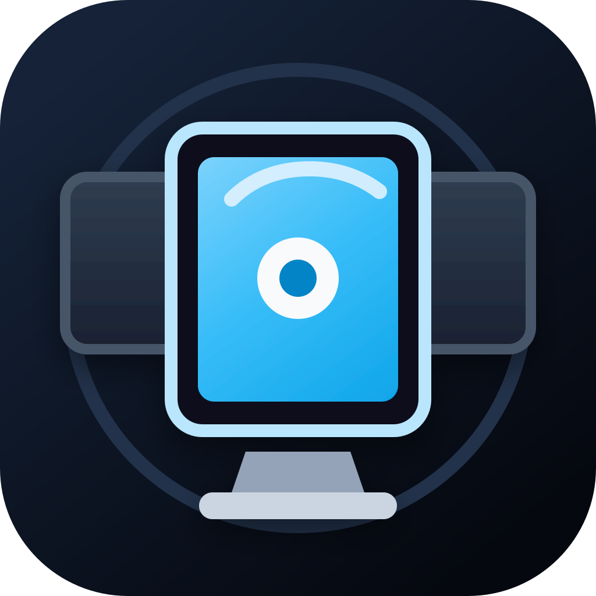

# OneScreen

<p align="center">
  
</p>

## OneScreen for macOS

Keep one display active and dim or black out the rest.

[Download the latest release](https://github.com/Jinshuo7/OneScreen/releases/latest) for macOS Ventura, Sonoma, Sequoia, Tahoe, and newer versions that support macOS 13+ apps.

## About OneScreen

**OneScreen** is a small macOS menu bar utility for multi-display setups. Pick the screen you want to focus on, and OneScreen covers every other display with a dim or black overlay.

It is designed for people who use multiple monitors but sometimes want one clear, distraction-free workspace.

## Key Features

- Choose which connected display stays active.
- Dim or fully black out every other display.
- Use menu bar controls for quick display switching.
- Set keyboard shortcuts for blackout and clear actions.
- Remember your preferred display.
- Restore all displays with `Esc`, your clear shortcut, or the menu bar.
- Launch at login from the Preferences window.
- Optional BetterDisplay hardware blackout support when BetterDisplay is installed.

## Installation

1. Download `OneScreen-1.0.zip` from the [latest release](https://github.com/Jinshuo7/OneScreen/releases/latest).
2. Unzip the downloaded file.
3. Move `OneScreen.app` to your `Applications` folder.
4. Open `OneScreen.app`.

Because this app is not notarized by Apple yet, macOS may warn that it cannot verify the developer. If that happens, right-click `OneScreen.app`, choose **Open**, then confirm that you want to open it.

## Using the App

After opening OneScreen, use the **OneScreen** icon in the menu bar.

- Choose a display from the menu to keep that display active.
- Choose **Clear Blackout** to restore all displays.
- Choose **Preferences...** to set shortcuts, overlay mode, dim amount, preferred display, hardware blackout, and launch at login.
- Choose **Refresh Displays** if display names or resolutions change.
- Choose **Quit OneScreen** to exit the app.

## Compatibility

- Requires macOS 13 Ventura or newer.
- Supports Apple Silicon Macs.
- The current release is built as an arm64 macOS app.
- OneScreen does not capture the screen, so it should not need Screen Recording permission.

## BetterDisplay Hardware Blackout

OneScreen can optionally ask BetterDisplay to set hardware brightness to zero for displays that are being blacked out.

This is optional. The regular dim and blackout overlays work without BetterDisplay.

The hardware blackout option requires BetterDisplay to be installed at:

```text
/Applications/BetterDisplay.app
```

## Notes

**Black out** draws fully black pixels over inactive displays. **Dim** uses your selected opacity.

A black overlay does not turn off an external monitor's backlight. LCD displays can still glow even when showing black pixels. Hardware blackout through BetterDisplay may help on supported displays.

## Building from Source

Most users do not need this section. If you downloaded `OneScreen-1.0.zip` from Releases, you can just unzip the app and open it.

This section is for developers who want to build the app from the source code.

Requirements:

- macOS 13 or newer
- Xcode Command Line Tools

Build the app and release zip:

```bash
Scripts/package_app.sh
```

The script creates:

```text
build/release/OneScreen.app
build/release/OneScreen-1.0.zip
```

Upload `build/release/OneScreen-1.0.zip` to a GitHub Release if you are publishing a new version.

## License

OneScreen is released under the MIT License. See [LICENSE](LICENSE).
